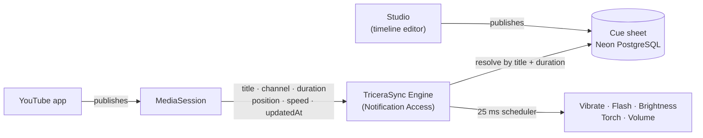

<div align="center">

# TriceraSync

**Synchronized haptics and multi-sensory effects for YouTube on Android.**

TriceraSync lets creators attach vibration, screen flash, brightness, torch, and volume cues to a YouTube video on a timeline, and an Android companion app triggers them on the viewer's phone in real-time while they watch in the **normal YouTube app**.

[**Open the Studio**](https://tricerasync.vercel.app) · [**Download the APK**](release/tricerasync-engine.apk) · [Try the demo](#try-the-demo) · [How it works](#how-it-works) · [Cue format](#the-cue-format-pcf-v1)

<sub>Named after the Triceratops — three horns, one head. Three horns became the mark; the head is your phone.</sub>

</div>

---

## What it is

Most videos only give you sound and pixels. TriceraSync lets a creator attach physical feedback (vibrations, screen flashes, brightness dips, flashlight pulses, and audio volume ducking) to a YouTube video on a timeline, and an Android companion app triggers them on the viewer's phone in real-time while they watch inside the normal YouTube app.

Two halves:

|                                      |                                                                                                     |
| ------------------------------------ | --------------------------------------------------------------------------------------------------- |
| **Studio**: a web timeline editor    | Place cues against the finished video, preview them in the browser, and publish a version.          |
| **Engine**: an Android companion app | Detects what is playing in YouTube, fetches the matching cue sheet, and fires the physical effects. |

**No video is ever uploaded.** The creator's file plays locally in their browser. Only timestamps and matching metadata reach the server.

---

## How it works

YouTube does not offer a direct broadcast when a video plays. Instead, TriceraSync uses Android's system `MediaSession` (the same service that displays playback controls in your notification bar).



An app holding **Notification Access** can query active system `MediaSession` instances. YouTube's session exposes the video's title, channel name, and duration, plus a `PlaybackState` containing `position`, `playbackSpeed`, and `lastPositionUpdateTime`. Between updates, the current position is calculated in real time:

```
pos(now) = position + (now - lastPositionUpdateTime) * speed     while playing
pos(now) = position                                              otherwise
```

Measured accurate to within ~90 ms on real devices. No root, no accessibility service, no screen capture, and notification text is never read.

Because MediaSession does not include the raw YouTube video ID, videos are identified by normalized `(title, channel, duration +/- 1.5 s)`. Pre-roll ads report their own duration, so they are automatically ignored until the real video begins.

---

## Try the demo

You need an Android phone and about 2-3 minutes.

### 1. Install the Engine

**[Download tricerasync-engine.apk](release/tricerasync-engine.apk)** (7.6 MB, signed, package `com.tricerasync.engine`)

<details>
<summary><b>Google Play Protect warning: Why it appears and how to install</b></summary>

<br>

Because this is a direct sideloaded prototype requesting permissions to adjust screen brightness, display overlay flashes, and query media playback, **Google Play Protect flags it as an unverified app**.

**To install:** Tap **More details -> Install anyway**. If blocked by your device, open Play Store -> Profile -> _Play Protect_ -> Gear icon -> temporarily disable _Scan apps with Play Protect_, install, then turn it back on.

**Permissions used:**

| Permission                              | Why                                                                                                                     |
| --------------------------------------- | ----------------------------------------------------------------------------------------------------------------------- |
| Notification access                     | Allows querying `MediaSession` to check what is playing and current playback position. Notification text is never read. |
| Modify system settings                  | Controls screen brightness dips and restorations.                                                                       |
| Display over other apps                 | Renders full-screen color flashes over the video.                                                                       |
| Do Not Disturb access                   | Prevents volume adjustments from failing when DND mode is active.                                                       |
| Notifications                           | Displays the foreground service notification while sync is running.                                                     |
| Battery optimization exemption          | Prevents the OS from suspending the listener mid-video.                                                                 |
| Vibrate / Internet / Foreground service | Triggers haptics, fetches cue sheets, and manages the sync session.                                                     |

All hardware settings (brightness, volume, torch) are saved beforehand and restored as soon as playback ends or if the app closes. Uninstalling removes all data.

</details>

Open the app and grant the permissions shown. It connects to the live production server automatically.

### 2. Play a demo video in YouTube

Two 11-second test clips with 4 cues each (uploaded under the project's earlier name — the titles are what the Engine matches on, so they stay as they are):

| #     | Video                                                                 | What to watch for                                                    |
| ----- | --------------------------------------------------------------------- | -------------------------------------------------------------------- |
| **1** | [ParaSync Test Video 1](https://www.youtube.com/watch?v=0PBvTTpnTwI)  | `0.2s` buzz, `2.2s` red flash, `4.7s` screen dim, `5.2s` torch pulse |
| **2** | [ParaSync Test Video 2](https://www.youtube.com/watch?v=NeKuwt94DTk)  | `0.5s` buzz, `2.1s` red flash, `3.5s` screen dim, `5.1s` torch pulse |

Play either video in the **official YouTube app** (not a browser). TriceraSync changes status to **Synced** and triggers the effects as the video plays.

**Device Check** — a 31-second clip that walks through all five cue types with an on-screen countdown, so you can verify each effect on your own phone: [`docs/demo-videos/TriceraSync Device Check.mp4`](docs/demo-videos/TriceraSync%20Device%20Check.mp4)

| Time    | On screen        | Your phone                  |
| ------- | ---------------- | --------------------------- |
| `7.0s`  | Vibration · NOW  | buzzes                      |
| `12.0s` | Flash · NOW      | screen flashes white        |
| `17.0s` | Brightness · NOW | screen goes full bright     |
| `22.0s` | Torch · NOW      | back torch on for ~1.5 s    |
| `27.0s` | Volume · NOW     | the steady tone drops       |

### 3. Open the Studio

Visit **[tricerasync.vercel.app](https://tricerasync.vercel.app)** to view the web timeline editor where both sheets were authored. You can inspect the timeline, scrub with audio, and hit **Preview** to simulate the cues in your browser.

> Browsing is open. Creating, saving and publishing need the deployment's access token, entered once at `/unlock`.

---

## The Studio

### Landing and projects dashboard

The landing shows the product in one screen — a live cue firing on a phone, the five cue types, and the three steps — followed by every authored cue sheet with its version, cue count and publishing status.


### Multi-Track Timeline Editor

Five tracks: Vibrate, Brightness, Volume, Flash, and Torch. Press `M` to place a cue at the playhead, drag to reposition, or drag edges to set hold durations. Snapping, audio scrubbing, and undo/redo are built in.


Each cue's timestamp anchors to the left edge of the marker, with duration expanding to the right.


### Start a project without uploading anything

Point the editor to your local video file (runs in-browser via blob URL, never uploaded) or paste an existing YouTube URL.


### Publishing and live resolve activity

Link your YouTube URL, confirm the match signature, and publish. The page then streams the resolve API live so you can see your phone's incoming requests and verify matches instantly.


---

## The cue format (PCF v1)

Stored as standard JSON documents and delivered directly to the Engine:

```jsonc
{
  "version": 1,
  "video": { "provider": "youtube", "id": "0PBvTTpnTwI", "durationMs": 11000 },
  "meta": { "sheetVersion": 1, "fps": 30 },
  "defaults": { "restoreOnEnd": true, "toleranceMs": 120 },
  "cues": [
    {
      "id": "c_a1",
      "at": 210,
      "type": "vibrate",
      "params": { "mode": "oneShot", "durationMs": 200, "amplitude": 255 },
    },
    {
      "id": "c_b2",
      "at": 2204,
      "type": "flash",
      "params": {
        "color": "#FF0000",
        "opacity": 0.6,
        "durationMs": 150,
        "fadeOutMs": 150,
      },
    },
  ],
}
```

| Type         | Parameters                                                                                                                                     |
| ------------ | ---------------------------------------------------------------------------------------------------------------------------------------------- |
| `vibrate`    | `oneShot` (duration, amplitude 1-255), `waveform` (timings, amplitudes, repeat), `predefined` (`CLICK`, `DOUBLE_CLICK`, `HEAVY_CLICK`, `TICK`) |
| `flash`      | `color` (`#RRGGBB`), `opacity` (0-1), `durationMs`, `fadeOutMs`                                                                                |
| `brightness` | `level` (0-1), `rampMs`                                                                                                                        |
| `torch`      | `on` (boolean), `durationMs`, `strength` (0-1)                                                                                                 |
| `volume`     | `level` (0-1), `rampMs`                                                                                                                        |

### Firing rules

- **Instant cues** (`vibrate`, `flash`): Trigger once when the playhead crosses them, and never replay after seeking forward.
- **State cues** (`brightness`, `volume`, `torch`): Persist until the next cue of that type or until hold expires. Seeking backward or forward automatically re-evaluates active state so levels never remain stuck.

These rules exist across both the web studio preview and the Android engine to ensure browser previews match phone hardware execution.

---

## Efficiency and battery

The Engine keeps a local catalog of indexed videos. If your current video does not match any entry, it makes no server requests, runs no background sync session, and consumes no extra battery. During active playback, the scheduler ticks at 25 ms intervals and pauses immediately when playback is paused.

---

## Privacy and safety

- **No media leaves your machine**: Video files run locally in the browser. The database stores only timestamps.
- **Notification content is never read**: Notification Access is used strictly to read media session timing. Text, messages, and sender information are never accessed.
- **No telemetry or tracking**: No user accounts, analytics, or third-party SDKs.
- **Photosensitivity protection**: Flashes are capped at 3 per second and can be disabled in settings.
- **State restoration**: Brightness and volume levels are restored to their previous values as soon as video playback ends.

---

## Built with

- **Studio**: Next.js 16 (App Router), React 19, Tailwind CSS v4, Zustand, Zod, Drizzle ORM, PostgreSQL on Neon, Vercel, Bun. Type is Bricolage Grotesque for display and Geist for UI; the palette is ember on warm black.
- **Engine**: Kotlin 2.1, Jetpack Compose (Material 3), Coroutines, Android `MediaSessionManager`, `VibratorManager`, Camera2 API.

Unit tests cover the cue schema, shared normalization vectors, timeline calculations, and scheduler behavior under seek, pause, drift, and clock skew.

---

## Limitations

- **Initial lookup delay**: On the very first play, fetching and caching the cue sheet from the database takes a split second. If the video has an effect in the opening moments, simply restart the video from 0:00 once the app catches the sheet to experience perfectly synchronized effects from start to finish.
- **Device haptic hardware**: Vibration intensity and response times vary across devices depending on whether the phone has a standard rotary motor (ERM) or a haptic linear actuator (LRA).

---

## Source

Studio and Engine live in this organisation: **[github.com/TraxDinosaur](https://github.com/TraxDinosaur)**. The Studio links back here from its header and footer.

---

## License

[**CC BY-SA 4.0**](LICENSE) © 2026 TraxDinosaur.
