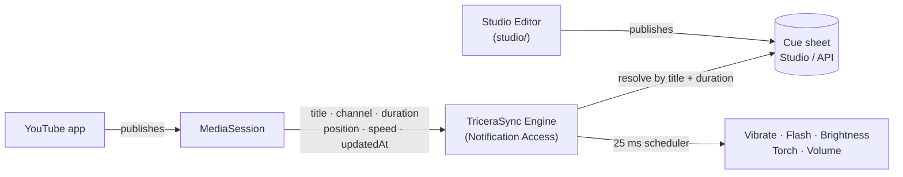
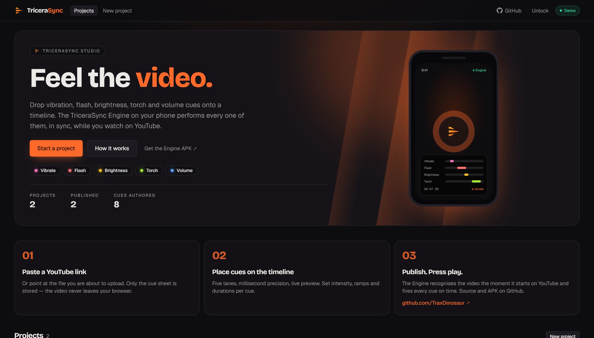
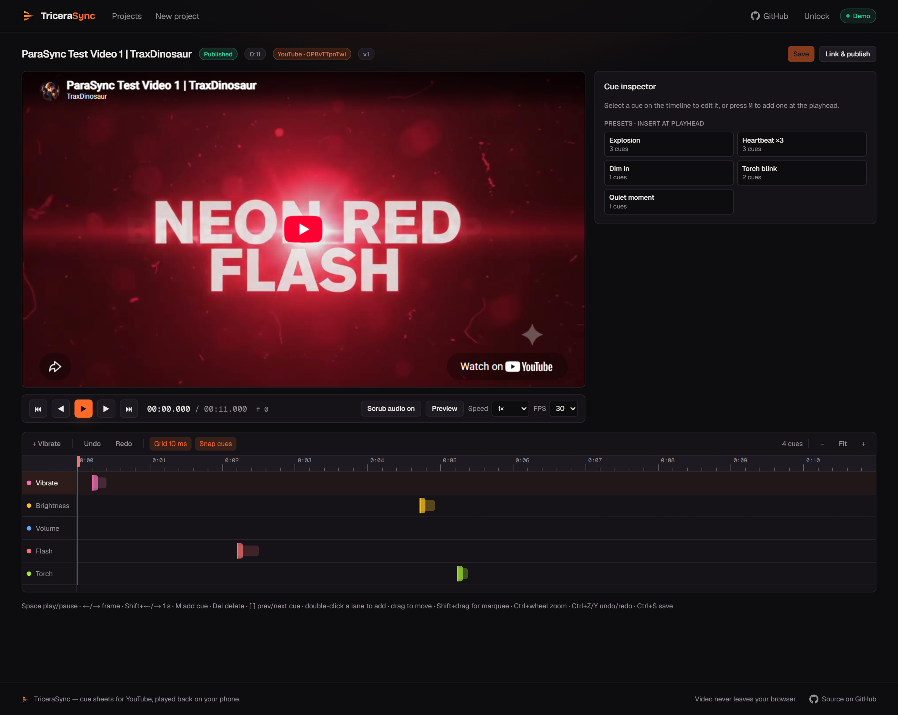
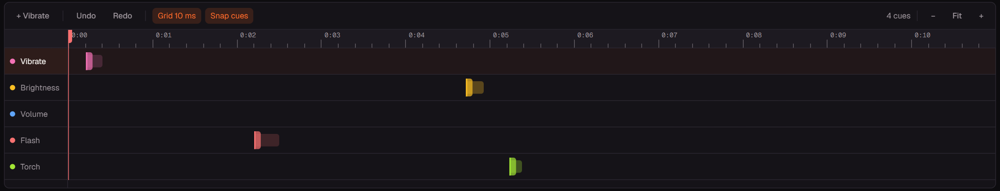
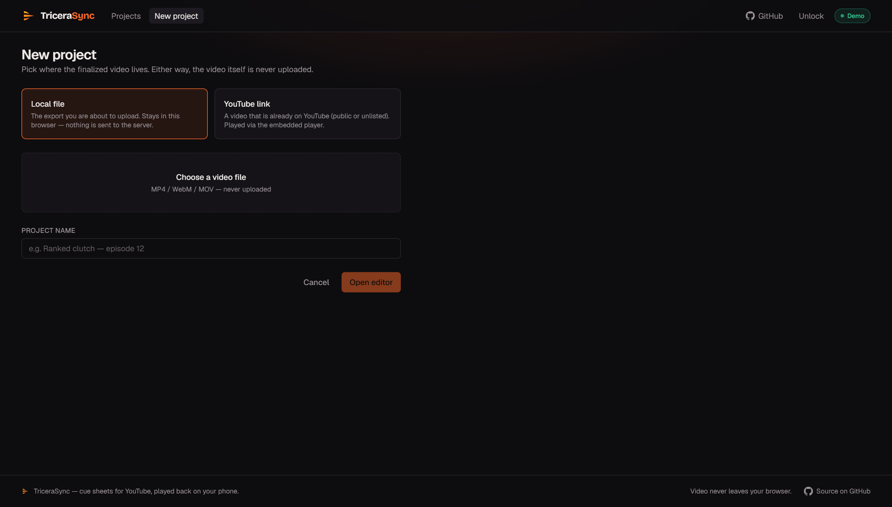
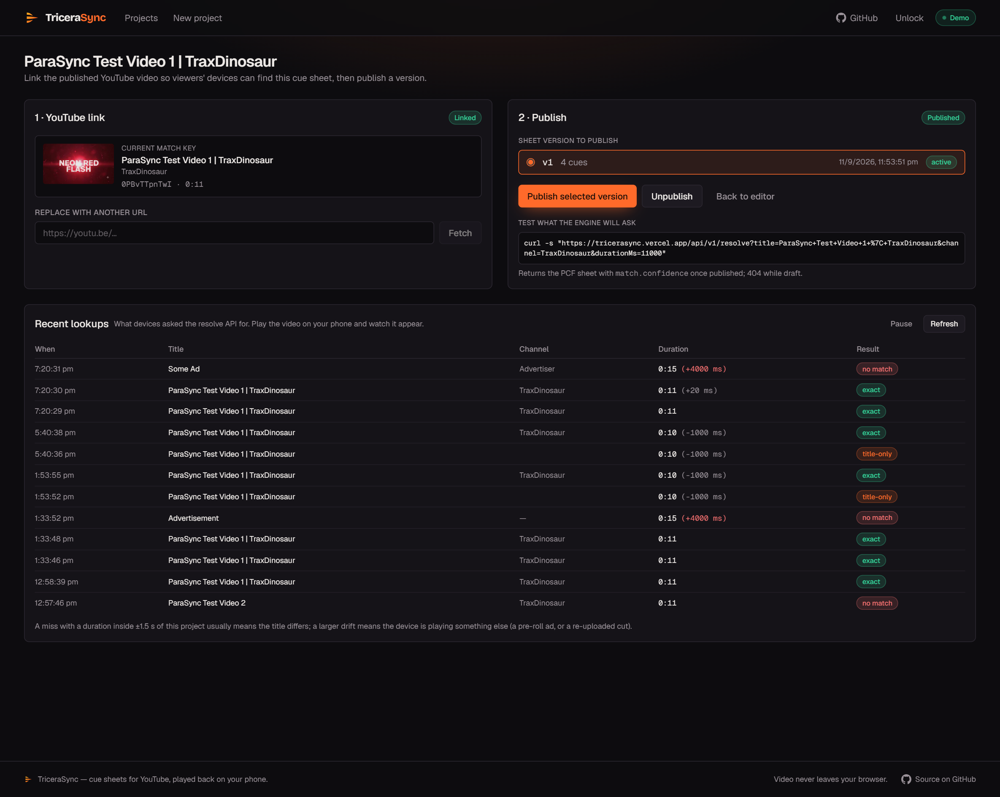

<div align="center">

# TriceraSync

**Synchronized haptics and multi-sensory effects for YouTube on Android.**

TriceraSync connects physical effects — vibration, screen flash, display brightness dips, camera torch pulses, and audio volume ducking — to video playback on Android, triggering them in real-time while you watch in the **official YouTube app**.

[**Open Official Studio**](https://tricerasync.vercel.app) · [**Download Pre-built APK**](release/tricerasync-engine.apk) · [**Try Demo**](#try-the-demo) · [**Studio**](#tricerasync-studio-web) · [**Engine**](#tricerasync-engine-android) · [**Permissions**](#permissions-explained) · [**PCF v1 Spec**](pcf/SPECIFICATION.md)

<sub>Named after the Triceratops — three horns, one head. Three horns form the mark; the head is your phone.</sub>

</div>

---

## What it is

Most video content only provides pixels and sound. TriceraSync gives creators a physical dimension:

- **Haptics**: Precise one-shot buzzes, complex waveforms, and hardware-tuned haptic clicks.
- **Screen flash**: Translucent color overlays synchronized with explosions, transitions, or beats.
- **Brightness**: Dynamic display backlight dipping and rising.
- **Torch**: Rear camera LED strobes and pulses.
- **Volume ducking**: Dynamic audio level adjustments.

The repository includes both halves of the project:
1. **TriceraSync Engine (`app/`)**: The open-source Android client that monitors YouTube playback via `MediaSessionManager`, extrapolates playhead timing within ~90 ms, and drives the hardware actuators.
2. **TriceraSync Studio (`studio/`)**: A self-hostable web timeline editor for placing cues, previewing them in the browser, and publishing cue sheets. Runs locally with zero external database dependencies.
3. **Physical Cue Format (PCF v1) (`pcf/`)**: The open standard specification and schema for synchronized physical cue sheets.

> **Hosted Service**: The official cloud deployment runs at **[tricerasync.vercel.app](https://tricerasync.vercel.app)**, operated by TraxDinosaur. The Engine connects to this hosted service by default, but can be freely pointed at any self-hosted Studio.

---

## How it works

Android does not provide a direct broadcast event when a third-party app plays media. Instead, TriceraSync utilizes Android''s system `MediaSessionManager` (the framework service backing playback controls in the notification shade).



When granted **Notification Access**, the Engine queries active system media sessions. YouTube''s session publishes playback state containing `position`, `playbackSpeed`, and `lastPositionUpdateTime`. Between OS updates, playback position is calculated in real time using monotonic clock math:

```
pos(now) = position + (now - lastPositionUpdateTime) * speed     while playing
pos(now) = position                                              otherwise
```

Sync accuracy is measured within **~90 ms** on physical hardware. This requires:
- **No root**
- **No accessibility services**
- **No screen recording or capture**
- **No notification text inspection** (text is never read)


---

## Try the demo

You can test TriceraSync right now on an Android phone in about 2 minutes:

### 1. Install the Engine

**[Download tricerasync-engine.apk](release/tricerasync-engine.apk)** (7.6 MB signed release, or compile from source via `./gradlew :app:assembleDebug`).

<details>
<summary><b>Installation & Permissions Note (Google Play Protect)</b></summary>

<br>

Because this is a direct sideloaded build requesting permissions to adjust display brightness, render overlay flashes, and query media session playback, **Google Play Protect may flag it as an unverified app**.

**To install:** Tap **More details -> Install anyway**.
</details>

Open the app and grant the permissions shown on screen. By default, it connects automatically to the official hosted service.

### 2. Play a test video in the official YouTube app

Open the **official YouTube app** on your phone (not a web browser) and play either of these demo clips:

| # | Video | What to watch & feel |
|---|---|---|
| **1** | [ParaSync Test Video 1](https://www.youtube.com/watch?v=0PBvTTpnTwI) | `0.2s` buzz, `2.2s` red flash, `4.7s` screen dim, `5.2s` torch pulse |
| **2** | [ParaSync Test Video 2](https://www.youtube.com/watch?v=NeKuwt94DTk) | `0.5s` buzz, `2.1s` red flash, `3.5s` screen dim, `5.1s` torch pulse |

TriceraSync displays status **Synced** and triggers physical effects in real time as the video plays.

### 3. Verify hardware effects with the Device Check video

Run the included reference check video: [`docs/demo-videos/TriceraSync Device Check.mp4`](docs/demo-videos/TriceraSync%20Device%20Check.mp4)

| Time | On screen | Your phone |
|---|---|---|
| `7.0s` | Vibration · NOW | Buzzes |
| `12.0s` | Flash · NOW | Screen flashes white |
| `17.0s` | Brightness · NOW | Screen goes full bright |
| `22.0s` | Torch · NOW | Rear camera torch on for ~1.5 s |
| `27.0s` | Volume · NOW | Steady audio tone drops |

### Identity and Matching

Because `MediaSession` does not expose YouTube''s internal 11-character video ID, videos are matched via normalized signatures: `(title, channel, duration +/- 1.5 s)`. Because pre-roll advertisements publish their own separate duration, they resolve to separate identities and are ignored automatically until the real video starts.

---

## TriceraSync Studio (Web)

The Studio is located under `studio/` and runs with **zero external database dependencies** using a local file-based JSON store (`studio/.data/studio-store.json`).

### Run Studio Locally

```bash
cd studio
bun install
bun run dev
```

The Studio will start at `http://localhost:3000` (bound to `0.0.0.0` so devices on your LAN can connect).

- **Create a project**: Enter a video name and link a YouTube URL (or upload a local file).
- **Edit cues**: Place cues across the five tracks (Vibrate, Flash, Brightness, Torch, Volume).
- **Preview**: Simulate effects directly in your browser.
- **Publish**: Link the project to activate the cue sheet for the Engine to query.

### Dashboard & Project Overview

The landing dashboard shows active projects, cue sheet versions, cue counts, and publishing state:



### Multi-Track Timeline Editor

Five dedicated lanes: Vibrate, Brightness, Volume, Flash, and Torch. Press `M` to drop cues, drag to position, and adjust durations with live browser simulation:



Each cue anchors to its starting timestamp, with duration expanding to the right:



### Video Linking & Publishing

Link your YouTube URL, confirm normalized signatures, and publish. The page provides a live resolve activity monitor to verify incoming phone requests in real time:






For full Studio documentation, see [`studio/README.md`](studio/README.md) and [`studio/docs/API.md`](studio/docs/API.md).

---

## TriceraSync Engine (Android)

### Prerequisites

- **JDK 17** (e.g. [Eclipse Adoptium Temurin 17](https://adoptium.net/))
- **Android SDK** (API Level 35, Build Tools 35.0.0)
- Set `ANDROID_HOME` in your environment (or create a `local.properties` file with `sdk.dir=/path/to/sdk`).

### Build and Install

Build debug APK:
```bash
./gradlew :app:assembleDebug
```
The output APK is generated at: `app/build/outputs/apk/debug/app-debug.apk`.

Install via ADB:
```bash
adb install -r app/build/outputs/apk/debug/app-debug.apk
```

Run unit tests:
```bash
./gradlew :app:testDebugUnitTest
```

### Connect Engine to Your Self-Hosted Studio

1. **At Runtime (in the app)**:
   - Open the Engine on your phone.
   - Go to **Settings** -> edit **Base URL** to `http://<your-computer-ip>:3000`.
   - Tap **Save**.
2. **At Build Time**:
   - You can bake your local server URL into the APK during build:
     ```bash
     ./gradlew :app:assembleDebug -Ptricerasync.server.url="http://192.168.1.50:3000"
     ```
   - Defaults to `https://tricerasync.vercel.app` if omitted.

---

## Permissions Explained

TriceraSync interacts with device hardware to deliver synchronized physical feedback:

| Permission | Identifier | Why it is needed |
|---|---|---|
| **Notification access** | `BIND_NOTIFICATION_LISTENER_SERVICE` | Required to query `MediaSessionManager` for YouTube playback state and position. **Notification text and messages are never read.** |
| **Modify system settings** | `WRITE_SETTINGS` | Controls display backlight brightness levels for brightness cues and restores original settings after playback. |
| **Display over other apps** | `SYSTEM_ALERT_WINDOW` | Renders full-screen translucent color flashes directly over playing video. |
| **Do Not Disturb access** | `ACCESS_NOTIFICATION_POLICY` | Ensures media volume adjustments do not fail when device is in Do Not Disturb mode. |
| **Notifications** | `POST_NOTIFICATIONS` | Displays the persistent foreground service notification while active sync is running. |
| **Battery optimization exemption** | `REQUEST_IGNORE_BATTERY_OPTIMIZATIONS` | Prevents Android OS from suspending the listener loop during background playback or screen transitions. |
| **Vibrate** | `VIBRATE` | Drives the device vibration motor (ERM/LRA) for haptic feedback. |
| **Camera** | `CAMERA` | Controls the rear camera LED torch pulses via the Android Camera2 API. |
| **Foreground Service / Internet** | `FOREGROUND_SERVICE`, `INTERNET` | Keeps the sync scheduler active during playback and retrieves cue sheets from the resolver API. |

---

## Privacy & Safety

- **No video media is ever transmitted**: Cue sheets contain only timestamps and parameter values. Videos are annotated entirely client-side in the browser.
- **Notification content is never read**: Notification Access is strictly used to interact with the system `MediaSessionManager` to read media playback state (title, channel, duration). Notification text, sender names, and message contents are never accessed or stored.
- **Zero personal data collected**: The Engine and Studio contain zero analytics frameworks, advertising SDKs, or user tracking.
- **Privacy-safe resolve activity logging**: When the Studio resolves cue sheets, it temporarily records video match signatures (`title`, `channel`, `durationMs`, matched sheet ID, match confidence, and timestamp) solely to power the creator live lookup dashboard. It stores **zero IP addresses, zero user agents, and zero device identifiers**. In self-hosted storage (`JsonFileStorage`), this log is capped strictly to the last 500 entries in FIFO order.
- **Photosensitivity protection**: Visual flashes are capped at 3 per second to mitigate seizure risks, and flashing can be toggled off completely in Settings.
- **Automatic state restoration**: Actuators capture baseline values (screen brightness, audio volume, torch state) before applying any cue and automatically restore them as soon as video playback ends, pauses, or the service stops.

---

## Repository Layout

```
.
├── app/                  # Android Engine module (Kotlin 2.1 + Jetpack Compose)
│   ├── src/main/java/    # Core logic, actuators, sync scheduler, UI
│   ├── src/main/res/     # Compose resources, drawables, XML configs
│   └── src/test/         # 24 unit tests (PCF parser, normalization, scheduler)
├── studio/               # Self-hostable web timeline editor (Next.js 16, React 19)
│   ├── src/              # Studio UI, timeline, inspector, storage interface
│   ├── docs/             # HTTP API contract and storage adapter docs
│   └── package.json      # Zero-database dependency configuration
├── pcf/                  # Physical Cue Format (PCF v1) open specification
│   ├── SPECIFICATION.md  # Format and timing specification
│   ├── schema.json       # JSON Schema definition
│   ├── schema.js         # Canonical JavaScript schema
│   └── normalize-vectors.json # Cross-platform normalization test vectors
├── docs/                 # Documentation assets, screenshots, and demo media
│   ├── screenshots/      # UI screenshots
│   └── demo-videos/      # Reference device check video
├── build.gradle.kts      # Android root build configuration
├── settings.gradle.kts   # Android project settings
├── NOTICE                # Attribution notice
├── LICENSE               # GNU General Public License v3.0 (GPLv3)
└── CONTRIBUTING.md       # Contribution guidelines
```

---

## License

- **Android Engine**: [GNU General Public License v3.0 or later (GPL-3.0-or-later)](LICENSE)
- **Studio (Web Editor)**: [GNU Affero General Public License v3.0 or later (AGPL-3.0-or-later)](studio/LICENSE)
- **Documentation, Specifications, and Media**: [Creative Commons Attribution-ShareAlike 4.0 International (CC BY-SA 4.0)](docs/LICENSE)

&copy; 2026 TraxDinosaur
